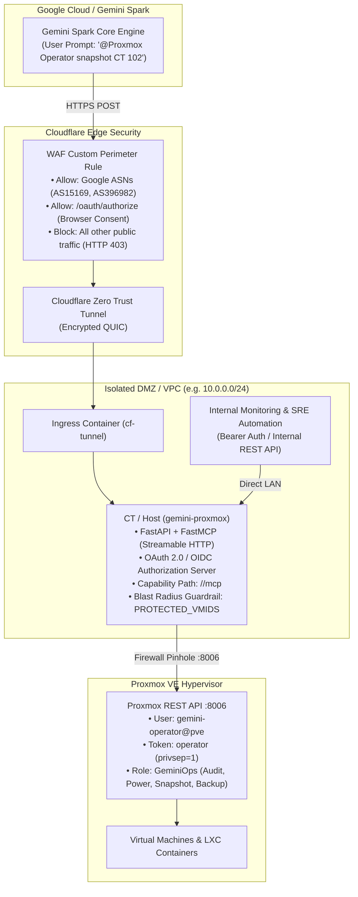

# Gemini-Proxmox VE Operator (MCP Gateway)

[](https://www.python.org/downloads/)
[](https://fastapi.tiangolo.com)
[](https://modelcontextprotocol.io/)
[](https://www.proxmox.com)
[](LICENSE)

An enterprise-grade, defense-in-depth operations gateway exposing Proxmox VE hypervisor management to **Google Gemini (Custom Connected Apps for Gemini Spark)** and **any MCP client** supporting the **Model Context Protocol (MCP)** over **Streamable HTTP** with RFC OAuth 2.0 / Bearer authentication, while retaining authenticated local REST telemetry for internal monitoring and SRE automation pipelines.

---

## Architecture Overview



---

## Key Features

* **Native Model Context Protocol (MCP):** Implements the official MCP Streamable HTTP transport for stateful, low-latency AI tool execution.
* **Universal MCP Client Compatibility:** Built strictly on the open Model Context Protocol (MCP) Streamable HTTP specification. Works out of the box with **Google Gemini (Custom Connected Apps)** and **any MCP client or agent framework** supporting Streamable HTTP and OAuth 2.0 (Authorization Code + PKCE) or Bearer token authentication (including Claude Desktop, Cursor, LibreChat, OpenWebUI, or custom LangChain/LlamaIndex/CrewAI agents).
* **Built-in OAuth 2.0 & OIDC Authorization Server:** Full RFC-compliant OpenID Connect discovery (`/.well-known/openid-configuration`, `/.well-known/oauth-authorization-server`), browser consent redirect flow (`/oauth/authorize`), and token issuance with signed HMAC-SHA256 JWT `id_token`.
* **Dual-Format Body Parser:** Handles both standard `application/x-www-form-urlencoded` and Google JSON token exchange payloads without FastAPI stream consumption errors.
* **5-Layer Defense-in-Depth:**
  1. **Edge WAF Filtering:** Restricts ingress strictly to Google datacenters (AS15169 / AS396982) and browser authorization.
  2. **128-bit Cryptographic Capability Path:** The MCP endpoint is mounted at an unguessable UUID path.
  3. **OAuth 2.0 Bearer Authentication:** Enforces signed JWT verification on MCP endpoints.
  4. **Code-Level Blast-Radius Guardrails:** Hardcoded `PROTECTED_VMIDS` prevents AI from stopping or rebooting critical ingress containers.
  5. **Hypervisor RBAC Separation:** Dedicated `GeminiOps` Proxmox role strictly excludes VM/storage deletion privileges.
* **Backward-Compatible REST Endpoints:** Exposes `/telemetry/*` endpoints authenticated via static LAN Bearer token for local dashboards and agents.

---

## 12 Registered Operational Tools

| Tool Name | Type | Description |
|-----------|------|-------------|
| `pve_cluster_status` | Read | Checks cluster quorum, health, node count, and resource load. |
| `pve_nodes_list` | Read | Lists hypervisor nodes, online state, CPU/RAM usage, and uptime. |
| `pve_guests_list` | Read | Returns complete inventory of all VMs and LXCs with running status. |
| `pve_guest_status` | Read | Detailed status, memory, CPU, and disk usage for a specific VMID. |
| `pve_storage_list` | Read | Evaluates storage pools and allocated disk usage. |
| `pve_recent_tasks` | Read | Shows recent tasks (backups, snapshots, starts) with exit statuses. |
| `pve_guest_start` | Write | Starts a stopped VM or container. |
| `pve_guest_stop` | Write | Shuts down a guest (fails on `PROTECTED_VMIDS`). |
| `pve_guest_reboot` | Write | Reboots a guest (fails on `PROTECTED_VMIDS`). |
| `pve_guest_snapshot` | Write | Takes a live snapshot without vmstate freeze (`vmid`, `snapname`, `description`). |
| `pve_guest_rollback` | Write | Reverts a guest to a previous snapshot (fails on `PROTECTED_VMIDS`). |
| `pve_guest_backup` | Write | Initiates an immediate vzdump backup of a guest to specified storage. |

---

## Cloudflare Edge WAF Architecture (Free Plan Solution)

On Cloudflare's Free tier, **Bot Fight Mode** runs in an isolated pipeline prior to WAF Custom Rules and challenges automated server-to-server POST requests from cloud datacenters with an interactive JavaScript challenge ("Just a moment..."). Because automated OAuth clients cannot solve browser JS challenges, account linking fails.

### The Solution:
1. Turn **Bot Fight Mode OFF** under *Security > Bots*.
2. Add a targeted **WAF Custom Rule** under *Security > Security rules*:
   ```text
   (http.host eq "pve-mcp.example.com" and not ip.src.asnum in {15169 396982} and not http.request.uri.path contains "/oauth/authorize")
   ```
3. Set Action to **Block** (HTTP 403).

**Result:** Google datacenters (AS15169 / AS396982) connect seamlessly to token and MCP endpoints, human browsers can complete `/oauth/authorize`, and all untrusted internet traffic is blocked cold at the edge.

---

## Installation & Setup

### 1. Proxmox VE RBAC Configuration
Run on your Proxmox VE host as `root`:
```bash
# 1. Create custom role without deletion rights
pveum role add GeminiOps -privs "VM.Audit VM.PowerMgmt VM.Snapshot VM.Backup Datastore.AllocateSpace"

# 2. Create dedicated service user
pveum user add gemini-operator@pve -comment "Gemini MCP Operator Service User"

# 3. Create API token with privilege separation
pveum user token add gemini-operator@pve operator -privsep 1

# 4. Assign permissions across cluster paths
pveum acl modify /vms -user gemini-operator@pve -role GeminiOps
pveum acl modify /nodes -user gemini-operator@pve -role GeminiOps
pveum acl modify /storage -user gemini-operator@pve -role GeminiOps
```

### 2. Environment Configuration
Clone the repository and copy the environment template:
```bash
git clone https://github.com/your-username/gemini-proxmox.git
cd gemini-proxmox
cp .env.example .env
```
Edit `.env` with your actual Proxmox API token, domain, and secret capability path.

### 3. Running with Systemd (LXC / VM)
```bash
# Create service user and venv
sudo useradd -r -s /usr/sbin/nologin gateway
python3 -m venv venv
./venv/bin/pip install -r requirements.txt

# Install systemd service
sudo cp gemini-proxmox.service /etc/systemd/system/
sudo systemctl daemon-reload
sudo systemctl enable --now gemini-proxmox
```

---

## Connecting to AI Clients

### 1. Connecting to Google Gemini (Spark / Connected Apps)

1. Open **Google Gemini** -> **Connected Apps** -> **Add Custom App**.
2. **App Name:** `Proxmox VE Operator`
3. **App URL:** `https://pve-mcp.example.com/<MCP_SECRET_PATH>/mcp`
4. **Authentication:** Select **OAuth 2.0**.
   * **Client ID:** Matches `OAUTH_CLIENT_ID` in `.env`.
   * **Client Secret:** Matches `OAUTH_CLIENT_SECRET` in `.env`.
   * **Authorization URL:** `https://pve-mcp.example.com/oauth/authorize`
   * **Token URL:** `https://pve-mcp.example.com/oauth/token`
5. Click **Connect**. Gemini will authorize via browser redirect, exchange tokens, and immediately discover all 12 Proxmox tools.

### 2. Connecting Any Streamable HTTP MCP Client

Because this gateway implements standard **Model Context Protocol (MCP) over Streamable HTTP** and standard RFC 6749 / OpenID Connect specifications, it works out-of-the-box with **any MCP client or agent framework** supporting Streamable HTTP:

* **Endpoint URL:** `https://pve-mcp.example.com/<MCP_SECRET_PATH>/mcp`
* **OAuth 2.0 Auto-Discovery:** Point your client or agent library to `https://pve-mcp.example.com/.well-known/oauth-authorization-server` or `/.well-known/openid-configuration`.
* **OAuth 2.0 Manual Setup:**
  * **Authorization URL:** `https://pve-mcp.example.com/oauth/authorize`
  * **Token URL:** `https://pve-mcp.example.com/oauth/token`
  * **Grant Types Supported:** `authorization_code` (with S256 PKCE), `refresh_token`, `client_credentials`.
  * **Client Auth Methods:** `client_secret_post` and `client_secret_basic`.
* **Static Bearer Token Auth:** For developer environments or agent frameworks that pass static tokens rather than interactive OAuth redirects, supply `Authorization: Bearer <API_BEARER_TOKEN>` or a valid JWT directly in the request headers.

> [!NOTE]
> **Edge WAF Considerations for Non-Google Clients:**
> The Cloudflare WAF Custom Rule in this guide specifically allows Google ASNs (`AS15169`, `AS396982`). If you are connecting a client from another cloud provider (e.g. AWS, Anthropic, Azure) or a local IP, update your Cloudflare WAF rule to permit your client's source IP / ASN, or route traffic over a private LAN / WireGuard tunnel.

---

## License

This project is licensed under the MIT License - see the [LICENSE](LICENSE) file for details.
